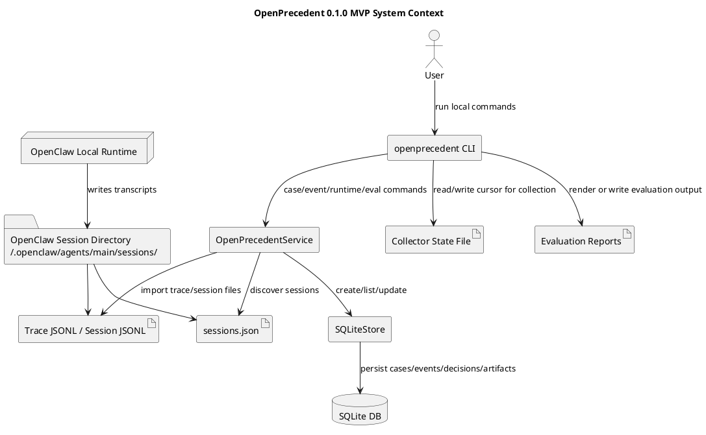
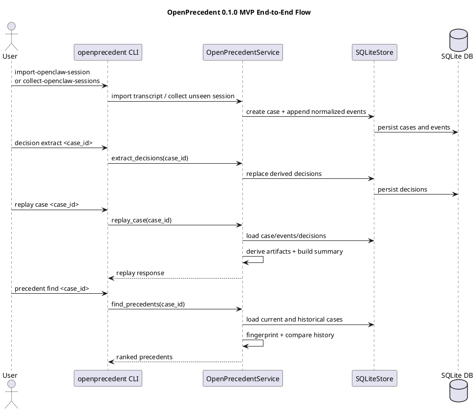
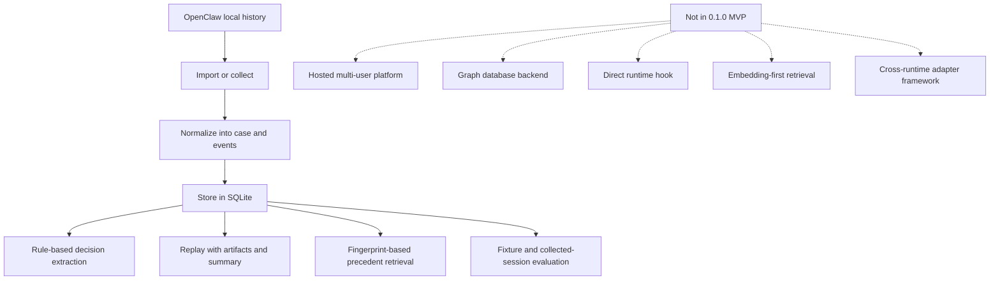
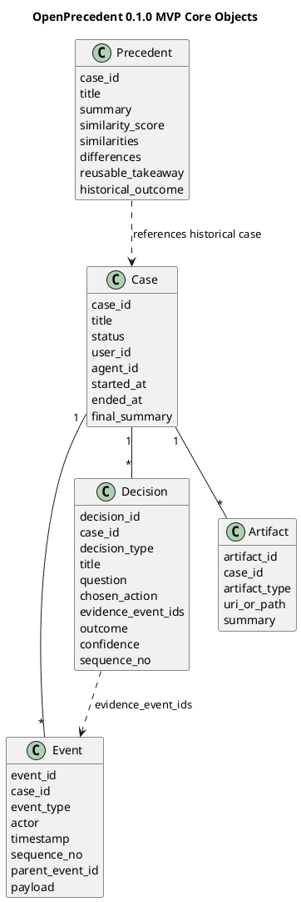

# OpenPrecedent 0.1.0 MVP Architecture

Chinese version: [中文版本 / 0.1.0 MVP 架构文档](/workspace/02-projects/incubation/openprecedent/docs/zh/architecture/mvp-design.md)
Status summary: [MVP status note](/workspace/02-projects/incubation/openprecedent/docs/product/mvp-status.md)

## Purpose

This document describes the architecture that is actually shipped in the OpenPrecedent `0.1.0` MVP release as of 2026-03-10.

It is intentionally implementation-grounded:

- local-first, single-agent workflow
- OpenClaw as the first integrated runtime
- SQLite-backed storage
- Rust CLI and Python service internals
- replay, explanation, and precedent retrieval over captured case history

This is not a future platform blueprint. It is the current MVP system boundary.

For the planned post-MVP replacement of the public executable surface with a Rust CLI, see:

- [rust-public-cli-design.md](/workspace/02-projects/incubation/openprecedent/docs/engineering/cli/rust-public-cli-design.md)

## Decision-Lineage Direction

As of 2026-03-10, OpenPrecedent has a shipped MVP extractor, but the product direction for `decision` is now explicitly narrower than the current implementation.

The normative rule is:

- `event` records process evidence
- `decision` records reusable judgment

That means the decision taxonomy must not include operational actions such as:

- tool choice
- file writes
- command execution
- retry mechanics
- generic finalize mechanics

Those remain useful event evidence, but they are not precedent-worthy decisions.

The first semantic decision taxonomy is:

- `task_frame_defined`
  the task boundary or problem framing was made explicit
- `constraint_adopted`
  a requirement, guardrail, or operating constraint was accepted
- `success_criteria_set`
  the standard for done or acceptable outcome was made explicit
- `clarification_resolved`
  a meaningful ambiguity was resolved and changed the task understanding
- `option_rejected`
  a candidate path was explicitly ruled out
- `authority_confirmed`
  a human approval, ownership boundary, or decision authority signal was confirmed

This taxonomy is the contract for follow-on implementation work.
If the shipped extractor still exposes older operational labels, treat that as transitional implementation behavior rather than the target decision model.

## What The 0.1.0 MVP Release Does

OpenPrecedent `0.1.0` MVP release can:

1. capture a case and ordered event timeline
2. import OpenClaw runtime traces and OpenClaw session transcripts
3. collect unseen OpenClaw sessions from a local session directory
4. extract structured decisions from stored events
5. replay a case with raw events, decisions, artifacts, and summary
6. retrieve similar prior cases as precedent
7. evaluate curated fixtures and collected OpenClaw sessions
8. surface runtime decision-lineage briefs for OpenClaw task planning against shared prior history

## What The 0.1.0 MVP Release Is Not

The `0.1.0` MVP release does not include:

- a multi-tenant hosted service
- a live runtime hook inside OpenClaw internals
- a graph database
- LLM-native decision extraction as the primary path
- semantic vector retrieval as the primary precedent engine
- a generalized adapter framework for many runtimes

## System Context

The shipped system has four operational layers:

1. runtime history source
2. local import and collection interface
3. normalization, extraction, replay, and retrieval service layer
4. local SQLite persistence

## End-to-End Flow

The core MVP loop is import first, then derive, then replay and retrieve:

## Capability Boundary

This flowchart shows the exact `0.1.0` MVP capability boundary.

## Core Data Model

The MVP object model is deliberately small. Raw history and derived records stay separate.

## Executable Interfaces

The current MVP executable surface is the local Rust CLI.

### Case and event operations

- `openprecedent case create`
- `openprecedent case list`
- `openprecedent case show`
- `openprecedent event append`
- `openprecedent event import-jsonl`

### Replay, decision, and precedent operations

- `openprecedent replay case`
- `openprecedent decision extract`
- `openprecedent decision list`
- `openprecedent precedent find`

### OpenClaw runtime operations

- `openprecedent capture openclaw list-sessions`
- `openprecedent capture openclaw import-jsonl`
- `openprecedent capture openclaw import-session`
- `openprecedent capture openclaw collect-sessions`
- `openprecedent lineage brief`

### Evaluation operations

- `openprecedent eval fixtures`
- `openprecedent eval captured-openclaw-sessions`

## Shipped 0.1.0 MVP Event Coverage

Supported event types:

- `case.started`
- `checkpoint.saved`
- `message.user`
- `message.agent`
- `model.invoked`
- `model.completed`
- `tool.called`
- `tool.completed`
- `command.started`
- `command.completed`
- `file.read`
- `file.write`
- `user.confirmed`
- `case.completed`
- `case.failed`

Current OpenClaw session mapping includes:

- session lifecycle records
- `checkpoint`
- `model_change`
- `thinking_level_change`
- user and assistant messages
- assistant tool calls
- tool results
- useful `custom` records when they carry replayable signal
- file reads inferred from read-only shell commands and image views
- file writes inferred from `apply_patch`

## Current Extractor Behavior and Decision Refocus

The shipped MVP extractor is still rule-based and currently emits an older operationally biased decision set.

That current implementation behavior should be read as transitional, not normative.
The semantic decision-lineage taxonomy defined earlier in this document is the product contract going forward.

Operational outputs such as tool choice, file writes, retries, and finalize markers should be treated as event evidence until the extractor is refit to the semantic taxonomy.

## Replay and Explanation Model

Replay combines four views built from the same stored case:

- case metadata
- ordered raw events
- derived decisions
- derived artifacts and summary

The explanation contract is evidence-bound:

- decisions store `evidence_event_ids`
- explanation text points back to event evidence
- raw events remain the source of truth
- derived decisions can be recomputed without rewriting the raw history

## Precedent Retrieval Model

The `0.1.0` MVP release keeps precedent retrieval case-oriented and lightweight.

It currently compares cases using fingerprints built from:

- case status
- presence of file writes and recovery steps
- tool-call count
- tool names
- file targets and read targets
- extracted decision types
- keywords derived from case content

This means the current precedent engine is explainable and auditable, but not yet embedding-first.

The current fingerprint still contains operational signals.
That is also transitional: future precedent behavior should prioritize semantic judgment lineage over operational similarity.

## Storage Model

Persistence is a single local SQLite database with three durable record layers:

- `cases`
- `events`
- `decisions`
- `artifacts`

Storage implications:

- raw events are persisted in order with `sequence_no`
- decisions are derived and replaceable per case
- artifacts are derived from events during replay
- there is no separate graph store or vector store in the `0.1.0` MVP release

## Operational Model

The MVP runtime validation path is local and import-based.

For OpenClaw this means:

- the runtime writes session files under `~/.openclaw/agents/main/sessions/`
- OpenPrecedent discovers sessions through `sessions.json`
- a collector command imports the latest unseen session
- a local state file prevents duplicate collection
- cron and systemd assets exist for unattended local scheduling
- runtime lineage retrieval should use a stable shared OpenPrecedent home rather than workspace-local accidental persistence
- the shipped OpenClaw skill guidance allows prior-decision consistency prompts to trigger lineage retrieval during initial planning

Related operational docs:

- [openclaw-silent-collection.md](/workspace/02-projects/incubation/openprecedent/docs/architecture/openclaw-silent-collection.md)
- [openclaw-collector-operations.md](/workspace/02-projects/incubation/openprecedent/docs/engineering/runtime/openclaw-collector-operations.md)
- [openclaw-collector-rollout-validation.md](/workspace/02-projects/incubation/openprecedent/docs/engineering/validation/openclaw-collector-rollout-validation.md)
- [openclaw-real-runtime-decision-lineage-validation.md](/workspace/02-projects/incubation/openprecedent/docs/engineering/validation/openclaw-real-runtime-decision-lineage-validation.md)
- [openclaw-runtime-decision-lineage-trigger-rerun.md](/workspace/02-projects/incubation/openprecedent/docs/engineering/validation/openclaw-runtime-decision-lineage-trigger-rerun.md)

## Accurate 0.1.0 MVP Capability Summary

If you want the shortest possible summary of the `0.1.0` MVP release, it is this:

1. import or collect local OpenClaw task history
2. normalize it into `case` and ordered `event` records
3. derive a narrow set of auditable `decision` records
4. replay the work with evidence and artifacts
5. compare the case to prior history and return reusable precedent

That is the shipped MVP.
