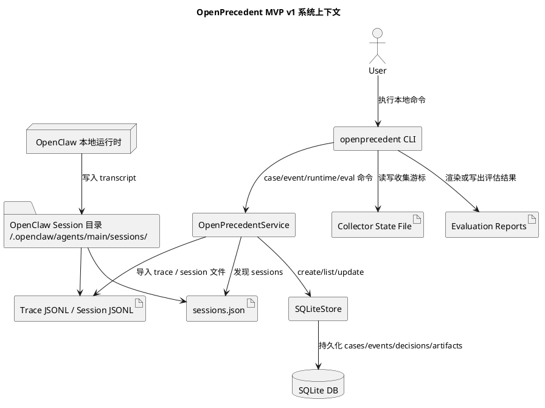
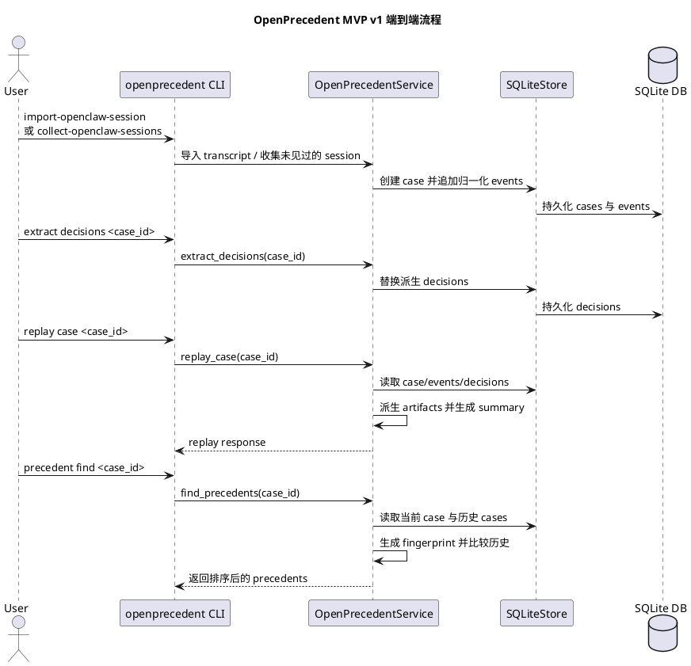
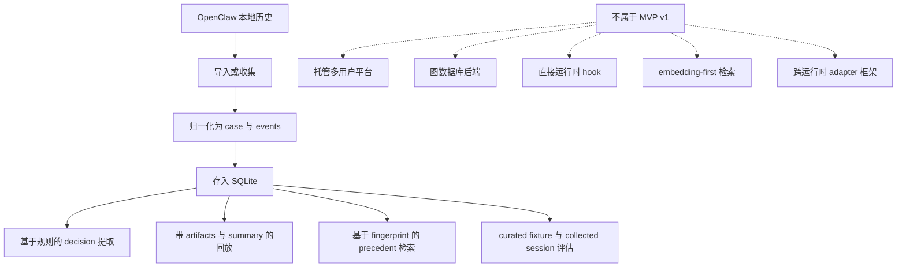
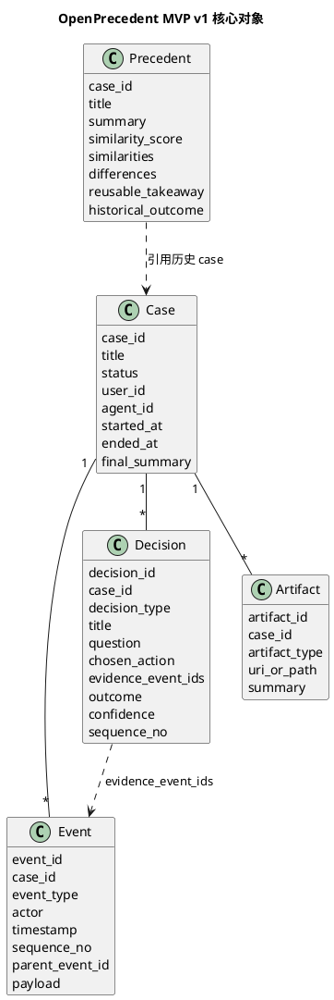

# OpenPrecedent MVP v1 架构文档

## 文档目的

本文描述的是截至 2026-03-10 实际已经交付的 OpenPrecedent MVP v1 架构。

它有意保持实现导向，而不是未来蓝图导向：

- 本地优先
- 单 agent 工作流
- OpenClaw 作为首个集成运行时
- 基于 SQLite 的本地存储
- 以 Python service 层与 CLI 作为执行接口
- 围绕 case 捕获、决策提取、回放解释与 precedent 检索闭环展开

这不是未来平台架构草图，而是当前 MVP 的真实系统边界。

## Decision-Lineage 方向约束

截至 2026-03-10，OpenPrecedent 已经有一个可运行的 MVP extractor，但产品层面对 `decision` 的定义现在已经明确收窄，不再等同于当前实现里出现过的全部 decision 标签。

规范性原则是：

- `event` 记录过程证据
- `decision` 记录可复用的判断

这意味着 decision taxonomy 中不应包含以下执行层动作：

- 工具选择
- 文件写入
- 命令执行
- 重试或恢复动作本身
- 泛化的 finalize 动作

这些内容仍然可以作为 event evidence 被保留，但不应被视为 precedent-worthy decision。

第一版 semantic decision taxonomy 定义为：

- `task_frame_defined`
  任务边界或问题 framing 被明确下来
- `constraint_adopted`
  某个要求、约束、护栏或工作边界被接受
- `success_criteria_set`
  完成标准或可接受结果标准被明确下来
- `clarification_resolved`
  一个真正影响任务理解的歧义被澄清并收敛
- `option_rejected`
  某条候选路径被明确排除
- `authority_confirmed`
  人类批准、责任边界或裁决 authority 信号被确认

这组 taxonomy 是后续实现工作的规范合同。
如果当前已交付 extractor 还暴露旧的执行层 decision 标签，应将其视为过渡性实现现象，而不是目标模型。

## MVP v1 已具备的能力

OpenPrecedent MVP v1 目前可以：

1. 捕获一个 case 及其有序事件时间线
2. 导入 OpenClaw runtime trace 与 OpenClaw session transcript
3. 从本地 session 目录收集尚未导入的 OpenClaw session
4. 从已存储事件中提取结构化 decision
5. 回放一个 case，并展示原始事件、决策、artifact 与 summary
6. 检索相似历史 case 作为 precedent
7. 评估 curated fixtures 与 collected OpenClaw sessions

## MVP v1 目前不包含什么

MVP v1 明确不包含：

- 多租户托管服务
- OpenClaw 内部的实时 hook
- 图数据库
- 以 LLM 为主路径的决策提取
- 以 embedding / 向量检索为主路径的 precedent 引擎
- 面向多运行时的通用 adapter 框架

## 系统上下文

当前已交付系统可以拆成四层：

1. 运行时历史来源
2. 本地导入与收集接口
3. 归一化、提取、回放与检索的 service 层
4. 本地 SQLite 持久化层

## 端到端执行流程

当前 MVP 闭环是先导入，再派生，再回放与检索：

## 能力边界

下面这张图描述了 MVP v1 的准确能力边界。

## 核心数据模型

MVP 对象模型刻意保持小而清晰，原始历史与派生对象分层存在。

## 可执行接口

当前 MVP 对外的可执行接口是本地 CLI，后面连接 Python service 层。

### Case 与 event 操作

- `openprecedent case create`
- `openprecedent case list`
- `openprecedent case show`
- `openprecedent event append`
- `openprecedent event import-jsonl`

### Replay、decision 与 precedent 操作

- `openprecedent replay case`
- `openprecedent extract decisions`
- `openprecedent decisions show`
- `openprecedent precedent find`

### OpenClaw runtime 操作

- `openprecedent runtime list-openclaw-sessions`
- `openprecedent runtime import-openclaw`
- `openprecedent runtime import-openclaw-session`
- `openprecedent runtime collect-openclaw-sessions`

### Evaluation 操作

- `openprecedent eval fixtures`
- `openprecedent eval collected-openclaw-sessions`

## 已交付的 MVP v1 Event 覆盖范围

当前支持的 event types：

- `case.started`
- `checkpoint.saved`
- `message.user`
- `message.agent`
- `model.invoked`
- `model.completed`
- `tool.called`
- `tool.completed`
- `command.started`
- `command.completed`
- `file.read`
- `file.write`
- `user.confirmed`
- `case.completed`
- `case.failed`

当前 OpenClaw session 的映射范围包括：

- session 生命周期记录
- `checkpoint`
- `model_change`
- `thinking_level_change`
- 用户与 assistant 消息
- assistant 发起的 tool calls
- tool results
- 带有可回放信号的 `custom` 记录
- 从只读 shell 命令和图片查看中推断出的 `file.read`
- 从 `apply_patch` 推断出的 `file.write`

## 当前 Extractor 行为与 Decision 重心调整

当前已交付的 MVP extractor 仍然是基于规则的，并且还会产出一组带有执行层偏向的旧 decision 标签。

这些当前实现行为应被理解为过渡状态，而不是规范定义。
本文件前面定义的 semantic decision-lineage taxonomy 才是后续产品与实现对齐的目标合同。

像工具选择、文件写入、重试恢复、finalize 这类输出，后续都应回到 event evidence 层来理解，而不是继续作为 decision taxonomy 的组成部分。

## Replay 与 Explanation 模型

回放是从同一个已存储 case 派生出的四种视图组合：

- case 元数据
- 有序原始事件
- 派生 decision
- 派生 artifact 与 summary

解释契约是 evidence-bound 的：

- decision 保存 `evidence_event_ids`
- explanation 文本回指具体 event 证据
- raw events 始终是事实源
- 派生 decisions 可以重算，而不改写原始历史

## Precedent 检索模型

MVP v1 的 precedent 检索是 case-oriented 且 lightweight 的。

当前比较 case 时使用的 fingerprint 主要来自：

- case 状态
- 是否存在文件写入和恢复步骤
- tool call 数量
- tool 名称
- 文件目标与 read 目标
- 提取出的 decision types
- 从 case 内容中派生的关键词

因此，当前 precedent 引擎是可解释、可审计的，但还不是 embedding-first。

当前 fingerprint 仍然包含不少执行层信号。
这同样属于过渡状态，后续 precedent 应逐步以 semantic judgment lineage 为主，而不是以操作相似性为主。

## 存储模型

当前持久化是一个本地 SQLite 数据库，包含四类持久记录层：

- `cases`
- `events`
- `decisions`
- `artifacts`

这意味着：

- raw events 会按 `sequence_no` 有序持久化
- decisions 是按 case 派生、可替换的
- artifacts 在 replay 时根据 events 派生
- MVP v1 不包含独立 graph store 或 vector store

## 运行与运维模型

MVP 的运行时验证路径是本地、导入式的。

对 OpenClaw 来说，这意味着：

- runtime 会把 session 文件写到 `~/.openclaw/agents/main/sessions/`
- OpenPrecedent 通过 `sessions.json` 发现 session
- collector 命令导入最新未见过的 session
- 本地 state file 用来避免重复收集
- 已提供 cron 与 systemd 资产用于无人值守本地调度

相关运行文档：

- [openclaw-silent-collection.md](/workspace/02-projects/incubation/openprecedent/docs/architecture/openclaw-silent-collection.md)
- [openclaw-collector-operations.md](/workspace/02-projects/incubation/openprecedent/docs/engineering/openclaw-collector-operations.md)
- [openclaw-collector-rollout-validation.md](/workspace/02-projects/incubation/openprecedent/docs/engineering/openclaw-collector-rollout-validation.md)

## 对 MVP v1 最准确的能力总结

如果只用最短的话概括 MVP v1，可以总结为：

1. 导入或收集本地 OpenClaw 任务历史
2. 将其归一化为 `case` 与有序 `event` 记录
3. 派生一组收敛且可审计的 `decision` 记录
4. 用 evidence 与 artifact 回放该 case
5. 将当前 case 与历史记录比较，返回可复用 precedent

这就是当前已经交付的 MVP。
